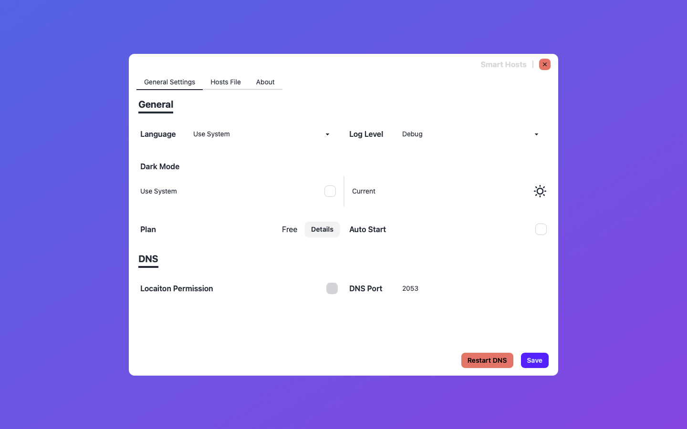
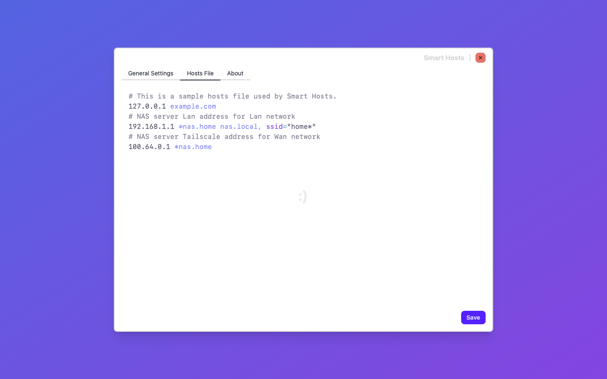
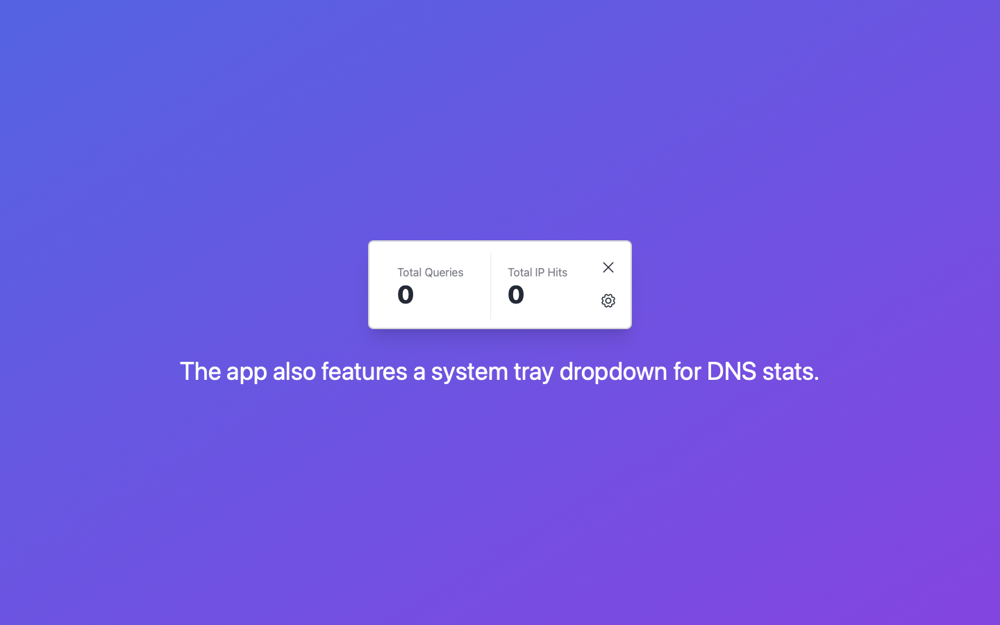
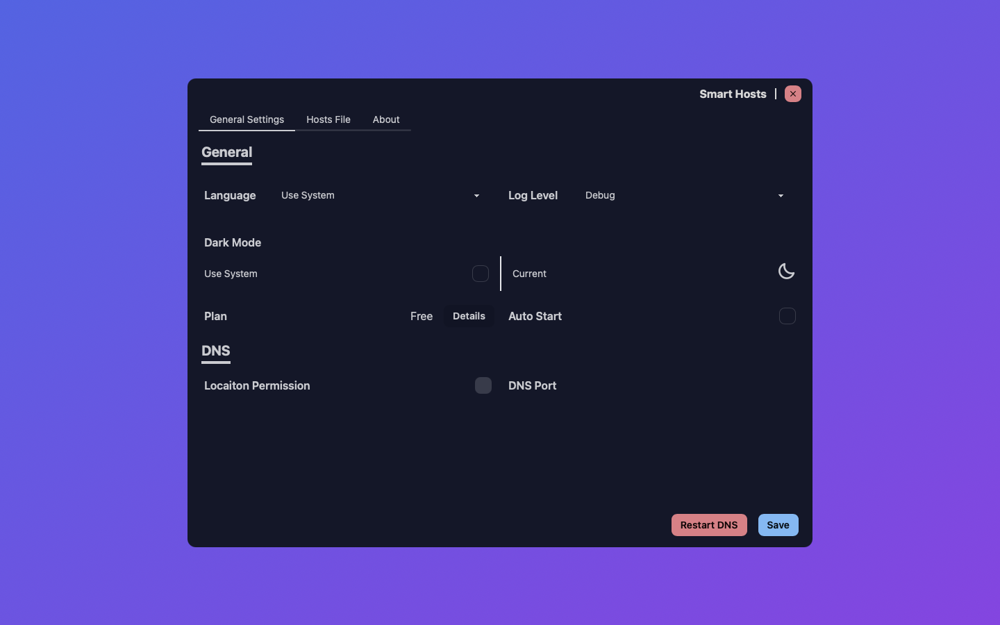
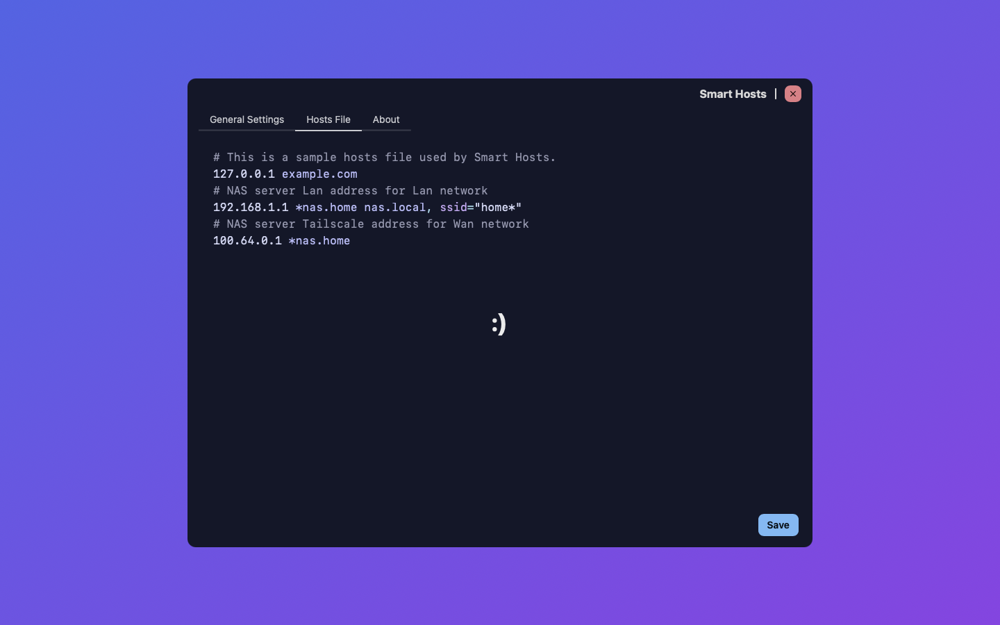

# Hi there 👋

[中文](./README.zh.md)

**Smart Hosts.app** is a desktop application
that helps users configure and customize domain resolution
for development or private environments.

## Smart Hosts.app

Serve your smart hosts file as a DNS server.

### Features

- Full /etc/hosts compatibility
- WiFI SSID-based resolution
- Unix shell pattern matching

### Stack

- [Tauri](https://github.com/tauri-apps/tauri) for building MacOS App.
- [Leptos](https://github.com/leptos-rs/leptos) for
  building front-end(User interface) of MacOS App.
  - [Trunk](https://github.com/trunk-rs/trunk)
  - [tailwindcss](https://github.com/tailwindlabs/tailwindcss)
  - [daisyUI](https://github.com/saadeghi/daisyui)
- Bridging
  - For bridging between Objective-C and Rust to interact with MacOS system.
    - [objc2](https://github.com/madsmtm/objc2) for bridging Network,
      Core WLAN and Core Location Apple Frameworks
    - the [forked version](https://github.com/turbocool3r/rust-dispatch) of [rust-dispatch](https://github.com/SSheldon/rust-dispatch)
      for bridging Dispatch Apple Framework.
  - For bridging between Swift and Rust to interact with MacOS system.
    - [swift-rs](swift-rs)
      for bridging StoreKit Apple Framework.
- DNS Protocol Implementation
  - Use [deku](https://github.com/sharksforarms/deku) to handle its binary protocol.

### Quick Links

- [Hosts file format](./Hosts.md)
- [Discussions](https://github.com/orgs/Smart-Hosts/discussions)
- [App Store](https://apps.apple.com/us/app/smart-hosts/id6738317830)

### Screenshots

### Screenshots Dark Mode

## Changelogs

### v0.2.1

- Add IAP items in App Store Connect
- Updated multiple third-party dependencies

### v0.2.0

- Supports in-app purchases to fund ongoing maintenance
  and new feature development
- Supports i18n, with Simplified Chinese (the author's native language) added first
- Optimized UI layout by dividing it into two configuration tabs:
  General Settings and Hosts File Editing
- Updated multiple third-party dependencies

