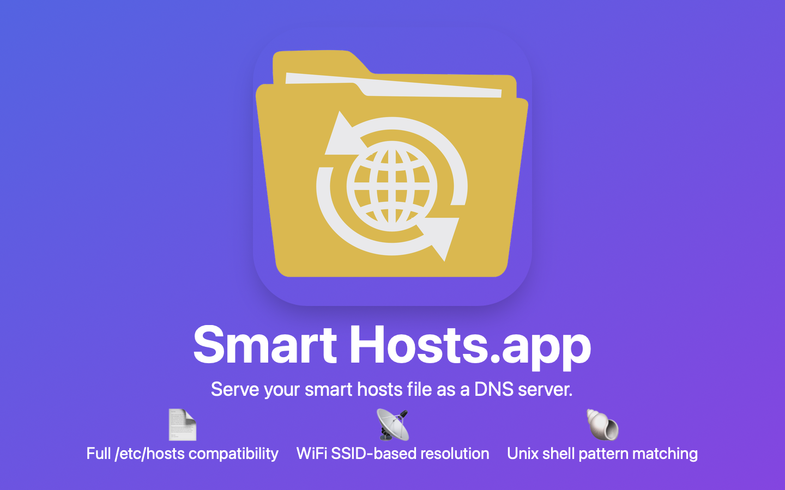
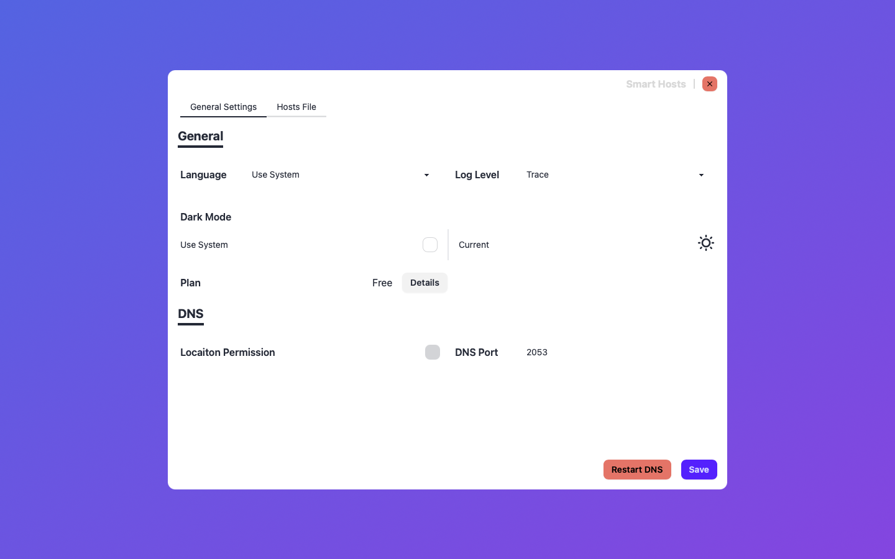
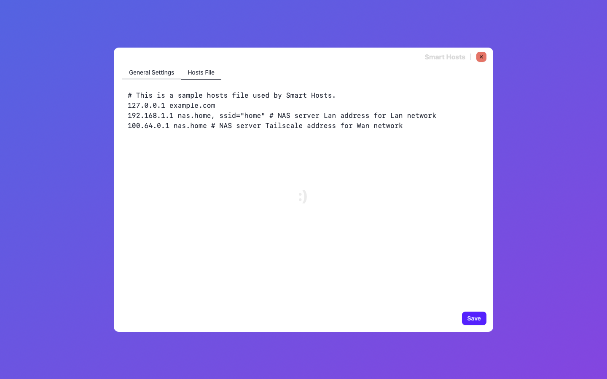
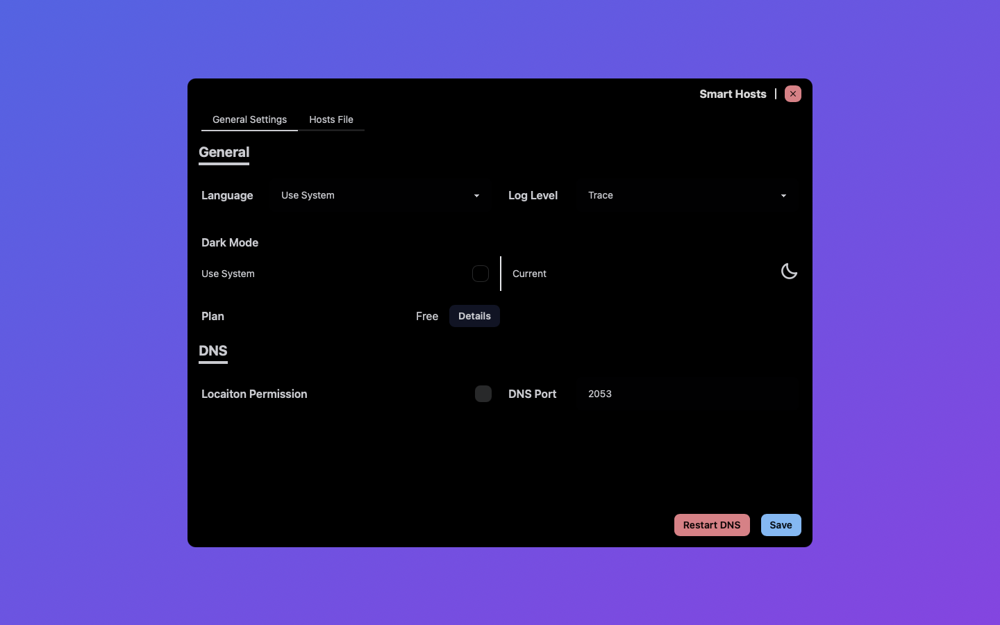
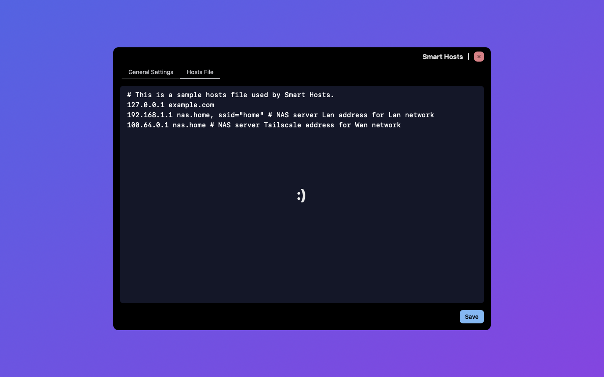
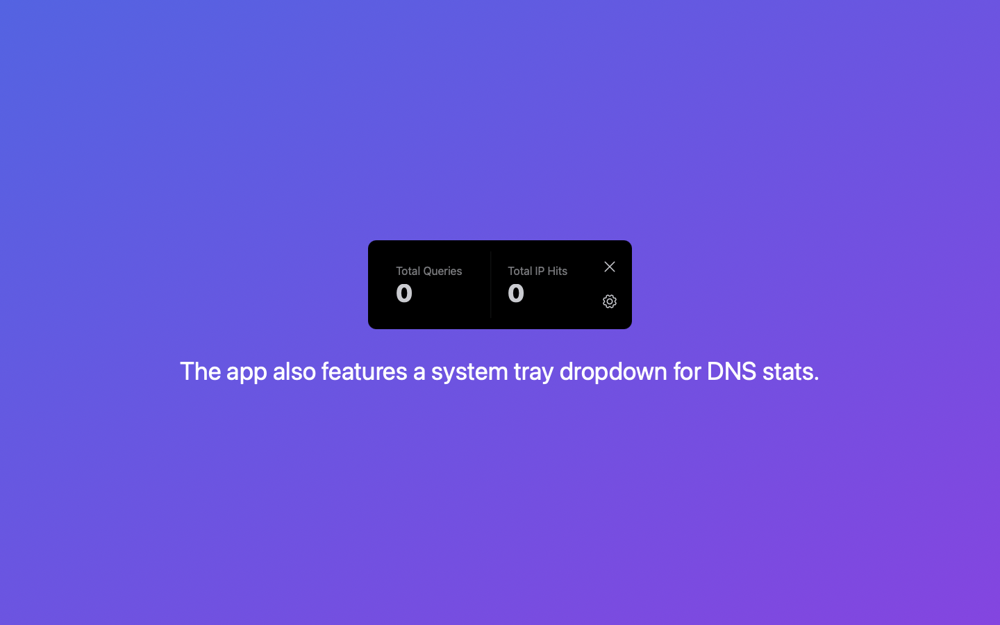

# Hi there 👋

**Smart Hosts.app** is a desktop application
that helps users configure and customize domain resolution
for development or private environments.

## Smart Hosts.app

Serve your smart hosts file as a DNS server.

### Features

- Full /etc/hosts compatibility
- WiFI SSID-based resolution
- Unix shell pattern matching

### Screenshots

### Screenshots Dark Mode

## Changelogs

### v0.2.0

- Supports in-app purchases to fund ongoing maintenance and new feature development  
- Supports I18N, with Simplified Chinese (the author's native language) added first  
- Optimized UI layout by dividing it into two configuration tabs: General Settings and Hosts File Editing  
- Updated multiple third-party dependencies  