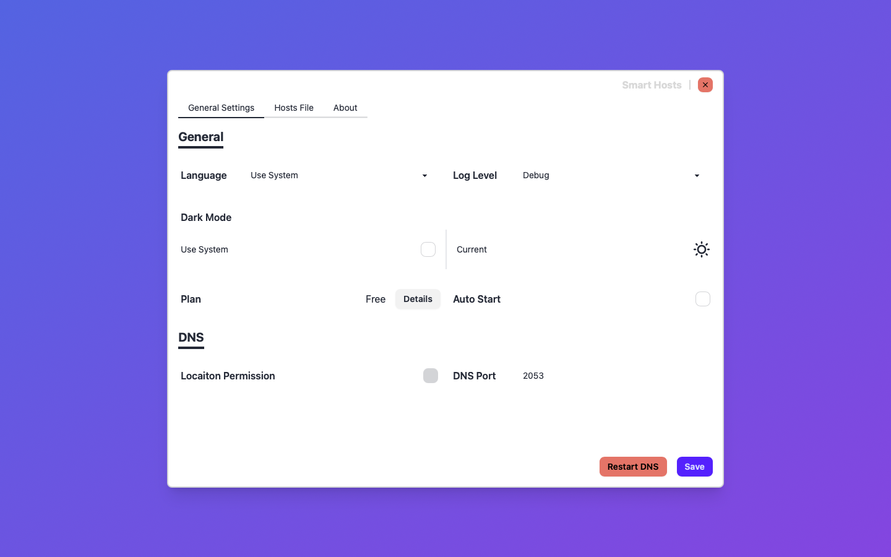
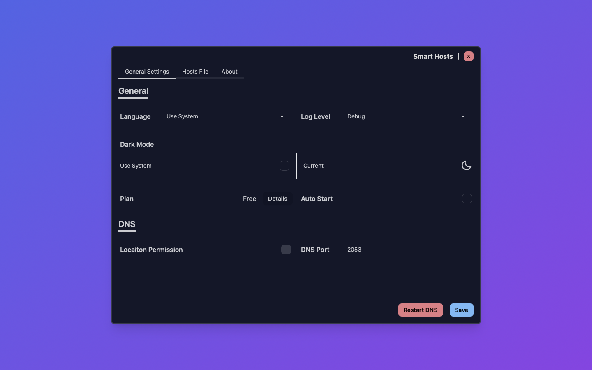
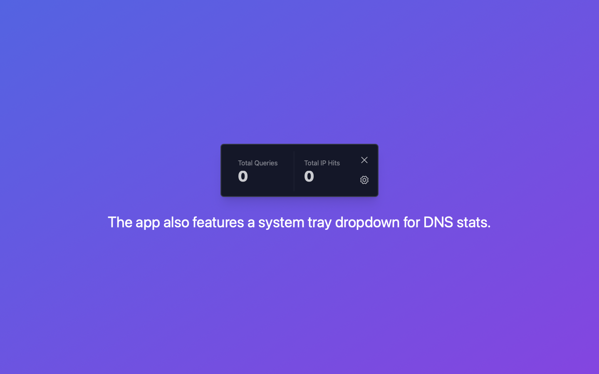

# Hi there 👋

[中文](./README.zh.md)

**Smart Hosts.app** is a desktop application
that helps users configure and customize domain resolution
for development or private environments.

## Smart Hosts.app

Serve your smart hosts file as a DNS server.

### Features

- Full /etc/hosts compatibility
- WiFI SSID-based resolution
- Unix shell pattern matching

### Quick Links

- [Hosts file format](./Hosts.md)
- [Discussions](https://github.com/orgs/Smart-Hosts/discussions)
- [App Store](https://apps.apple.com/us/app/smart-hosts/id6738317830)

### Screenshots

### Screenshots Dark Mode

## Changelogs

### v0.2.1

- Add IAP items in App Store Connect
- Updated multiple third-party dependencies

### v0.2.0

- Supports in-app purchases to fund ongoing maintenance
  and new feature development
- Supports i18n, with Simplified Chinese (the author's native language) added first
- Optimized UI layout by dividing it into two configuration tabs:
  General Settings and Hosts File Editing
- Updated multiple third-party dependencies

