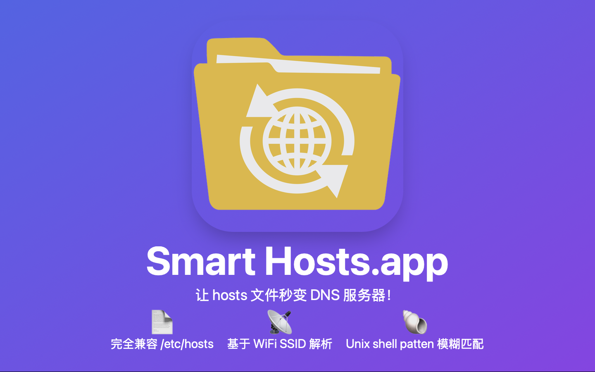
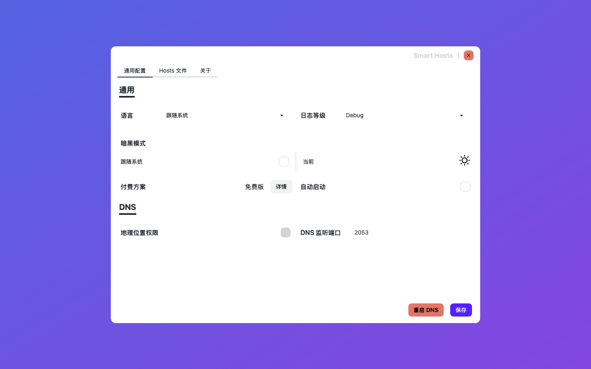
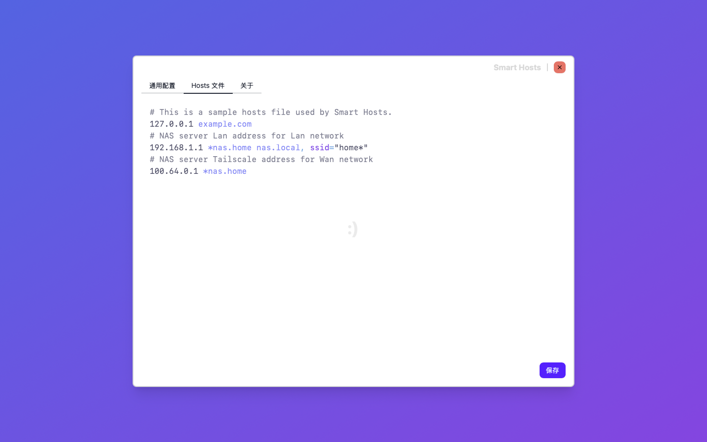
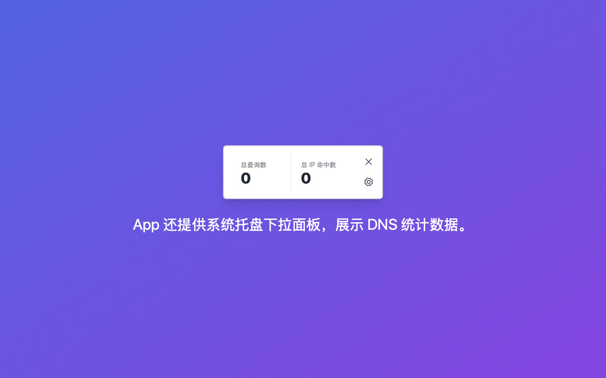
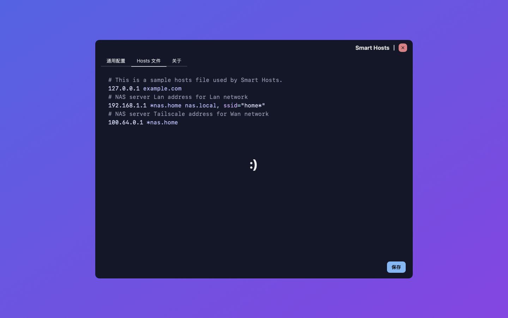
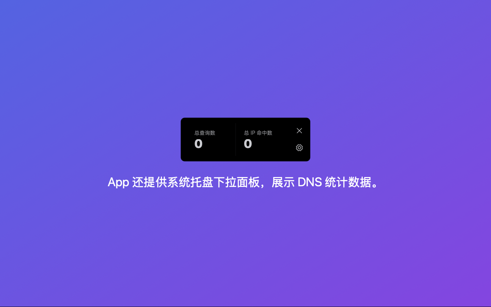

# 你好 👋

[English](./README.md)

**Smart Hosts.app** 本应用帮助开发者配置自定义域名解析规则，用于开发环境或私域访问。

## Smart Hosts.app

让 hosts 文件秒变 DNS 服务！

### 功能

- 完全兼容 /etc/hosts
- 基于 WiFi SSID 解析
- Unix shell pattern 模糊匹配

### 快捷链接

- [Hosts file 格式](./Hosts.zh.md)
- [讨论组](https://github.com/orgs/Smart-Hosts/discussions)
- [App Store](https://apps.apple.com/us/app/smart-hosts/id6738317830)

### 技术栈

- [Tauri](https://github.com/tauri-apps/tauri) 来构建 MacOS App。
- [Leptos](https://github.com/leptos-rs/leptos)
  用来构建 App 的前端（即用户界面）。
  - [Trunk](https://github.com/trunk-rs/trunk)
  - [tailwindcss](https://github.com/tailwindlabs/tailwindcss)
  - [daisyUI](https://github.com/saadeghi/daisyui)
- 跨语言调用
  - 跨 Objective-C 与 Rust 调用来与 MacOS 系统互动。
    - [objc2](https://github.com/madsmtm/objc2) 调用 Network，
      Core WLAN 和 Core Location Apple 框架。
    - 用 [rust-dispatch](https://github.com/SSheldon/rust-dispatch) 的 [forked version](https://github.com/turbocool3r/rust-dispatch)
      来调用 Dispatch Apple 框架。
  - 跨 Swift 与 Rust 调用来来与 MacOS 系统互动。
    - [swift-rs](swift-rs)
      来调用 StoreKit Apple 框架。
- DNS 协议实现
  - [deku](https://github.com/sharksforarms/deku) 来实现其二进制协议。

### 截屏

### 黑暗模式截屏

## 变更日志

### v0.4.0 (in TestFlight)

- 增加自动启动配置项
- 修复 SSID 通配符匹配缺失免费计划限制提示，及 Pro 计划的功能描述
- 更新多个第三方依赖
- 更新默认 Hosts 文件示例

### v0.3.0 (2024-12-29)

- SSID 支持 Unix Shell Style 通配符匹配
- 更新 Tray UI 的背景颜色
- 更新多个第三方依赖。主要是 Leptos 从 0.6 升级至 0.7.1

### v0.2.1

- App Store Connect 添加 IAP 项目
- 更新多个第三方依赖

### v0.2.0

- 支持内购，以支持 app 的后续维护及新功能开发
- 支持 i18n，优先添加了作者的母语，简体中文
- 优化 UI 布局，区分成两个配置分页：通用配置及 Hosts 文件编辑
- 更新多个第三方依赖
