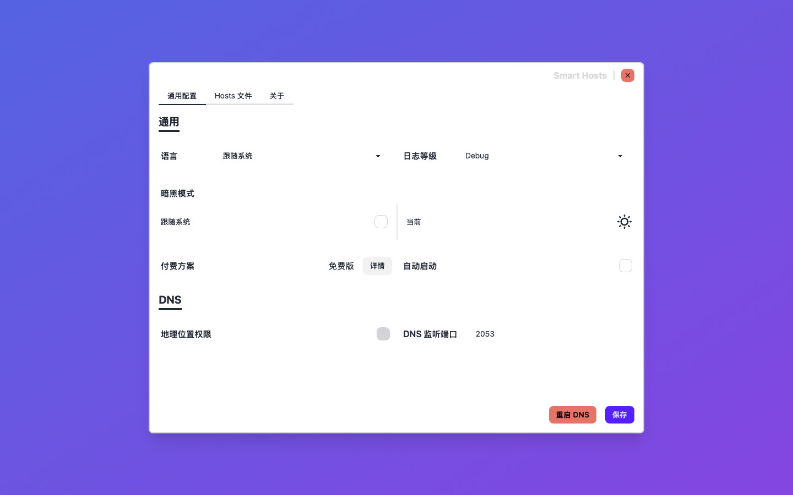
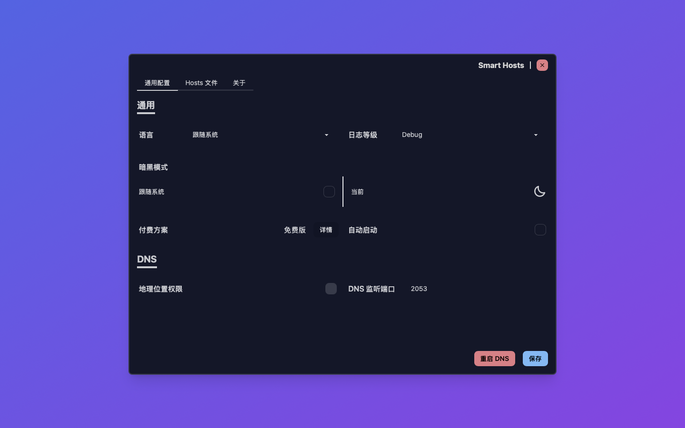
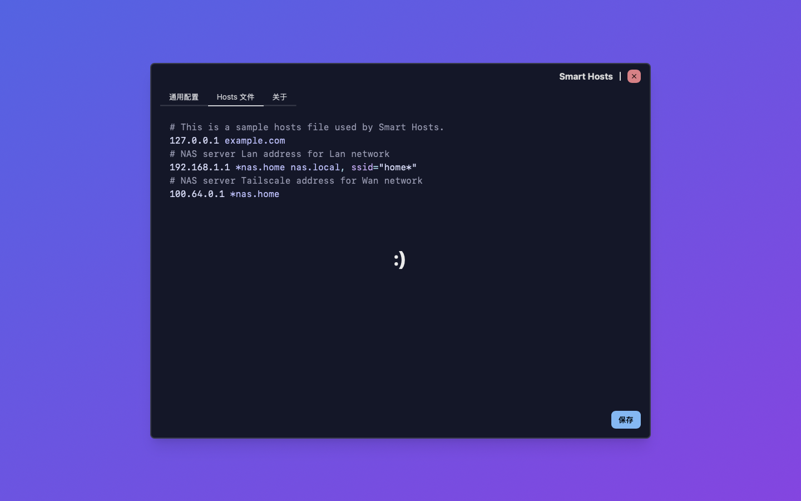
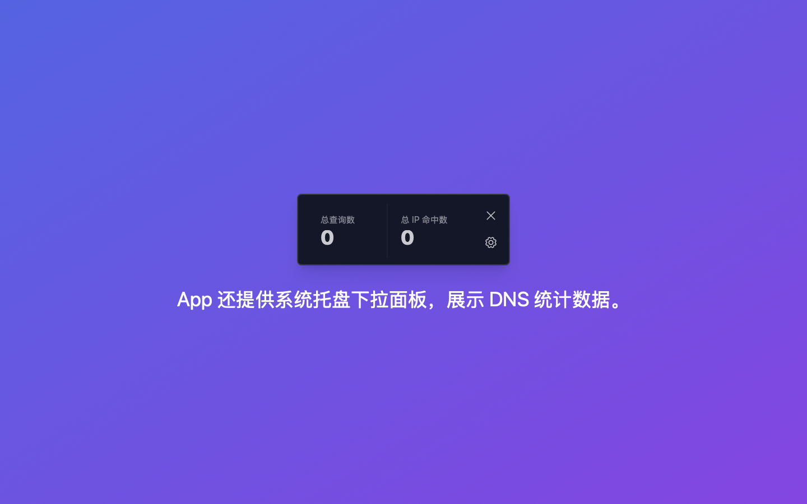

# 你好 👋

[English](./README.md)

**Smart Hosts.app** 本应用帮助开发者配置自定义域名解析规则，用于开发环境或私域访问。

## Smart Hosts.app

让 hosts 文件秒变 DNS 服务！

### 功能

- 完全兼容 /etc/hosts
- 基于 WiFi SSID 解析
- Unix shell pattern 模糊匹配

### 快捷链接

- [Hosts file 格式](./Hosts.zh.md)
- [讨论组](https://github.com/orgs/Smart-Hosts/discussions)
- [App Store](https://apps.apple.com/us/app/smart-hosts/id6738317830)

### 截屏

### 黑暗模式截屏

## 变更日志

### v0.2.1

- App Store Connect 添加 IAP 项目
- 更新多个第三方依赖

### v0.2.0

- 支持内购，以支持 app 的后续维护及新功能开发
- 支持 i18n，优先添加了作者的母语，简体中文
- 优化 UI 布局，区分成两个配置分页：通用配置及 Hosts 文件编辑
- 更新多个第三方依赖
